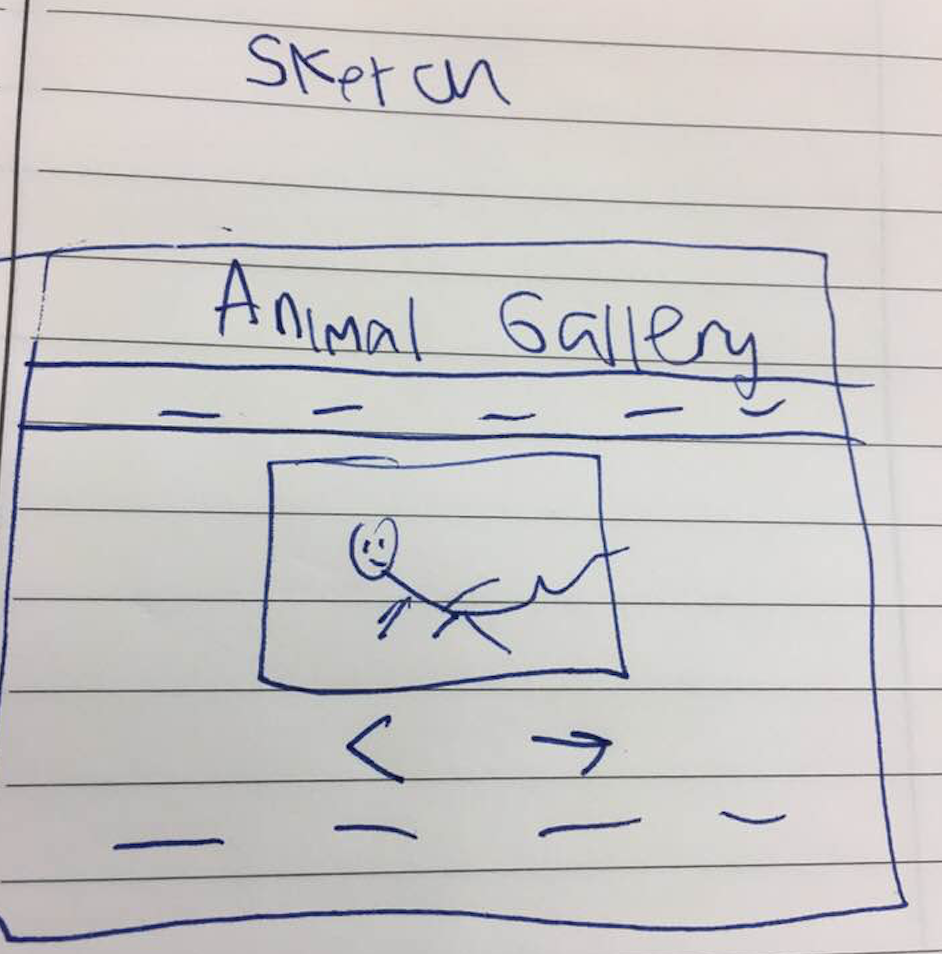
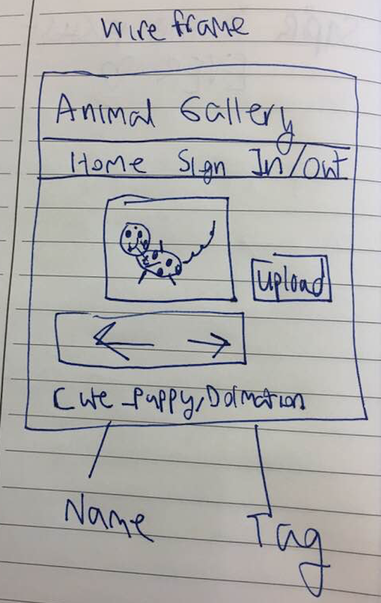

# Project 3 - Design & Plan

Your Name: Hamed Rabah

## 1. Persona

I've selected Abby my persona.

I've selected my persona because I think designing for Abby will also make the site
accessible the most amount of people as possible, since I will be forced to think
about designing a user friendly and intuitive site

## 2. Sketches & Wireframes

### Sketches




### Wirefames



[Explain why your design would be effective for your persona. 1-3 sentences.]

I think this design would be great for Abby because it is an intuitive suite where the focus
is on the content. Because of my conditional statements the only other page for Abby to worry about
will be the login/logout.

## 3. Database Schema Plan

[Describe the structure of your database. You may use words or a picture. A bulleted list is probably the simplest way to do this.]

Table: gallery
* field 1: image_id - the unique identifier of the photo NOT NULL AUTOINCRIMENT UNIQUE ID
* field 2: image_name - the name of the file of the image (TEXT) NOT NULL
* field 3: image_extension - the file extension of the image (TEXT) NOT NULL
* field 4: tag - The (user created) tag for the image (TEXT) NOT NULL

## 4. Database Query Plan

[Plan your database queries. You may use natural language, pseudocode, or SQL.]

1. All records

  SELECT * FROM gallery;

2. Search gallery photos by tag

    SELECT * FROM gallery WHERE tag = user_selection

3. Insert image

  INSERT INTO gallery(image_id,image_name,image_extension,tag)
    VALUES("123",example,"jpg",demo)

## 5. Structure and Pseudocode

### Structure

[List the PHP files you will have. You will probably want to do this with a bulleted list.]

* index.php - main page
* signIn.php - Sign In page for user
* signOut.php - Sign Out page for user
* includes/init.php - stuff that useful for every web page.
* includes/footer.php - format of footer and citations.


### Pseudocode

[For each PHP file, plan out your pseudocode. You probably want a subheading for each file.]

#### index.php

```
Pseudocode for index.php...

#### includes/init.php

TODO
SQL queries setup
HTML Photo gallery
Display database text

#### includes/footer.php
```

#### init.php
```

messages = array to store messages for user (you may remove this)

// DB helper functions (you do not need to write this out since they are provided.)

db = connect to db

...

HTML header
```
#### signIn.php

```
if signed_in == TRUE:
  show SingOut page
else:
  show signIn page

HTML FORM
userName - field
password - field
messages = array to store messages for user
[Sign in successful, incorrect username or password]

```
#### signOut.php

```
if signed_in == False:
  show SingIn page
else:
  show signOutpage

HTML FORM
button - sign out
if signingOut = True:
  signOut()

```

## 6. Seed Data - Username & Passwords

[List the usernames and passwords for your users]
* user1 : spider
* password1: pig
* user2: duckduck
* password2: goose
